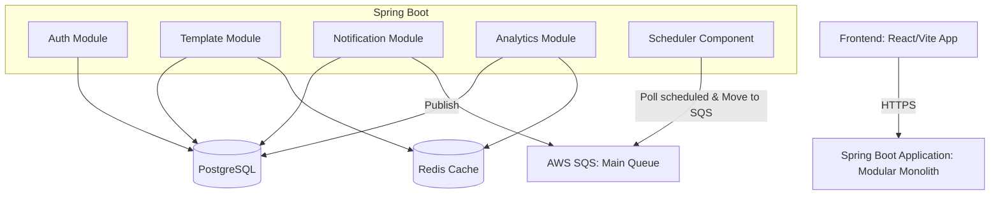
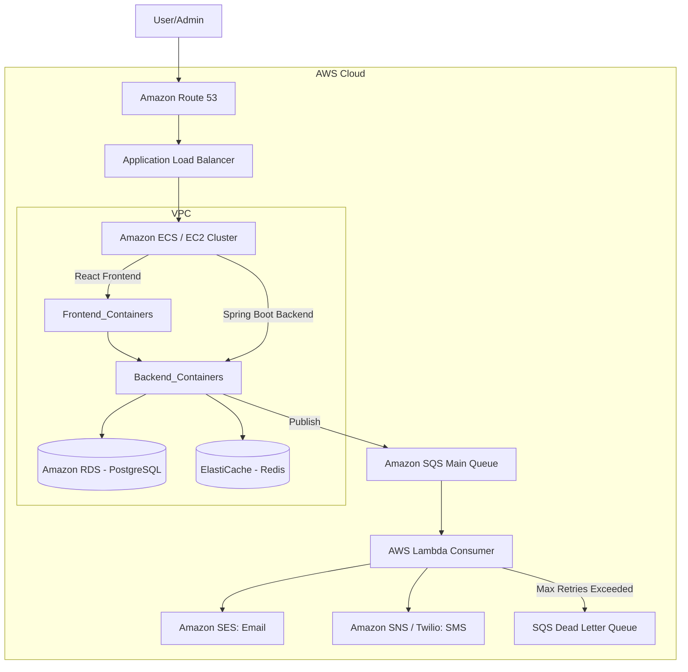
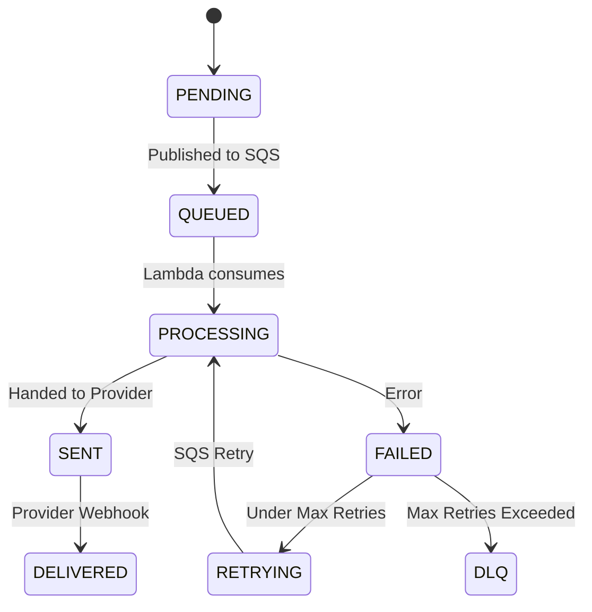
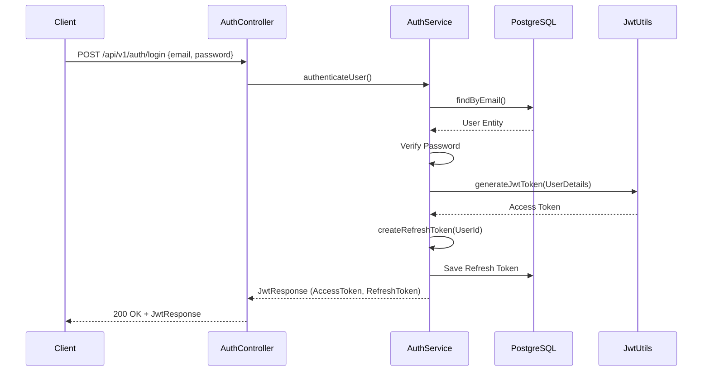
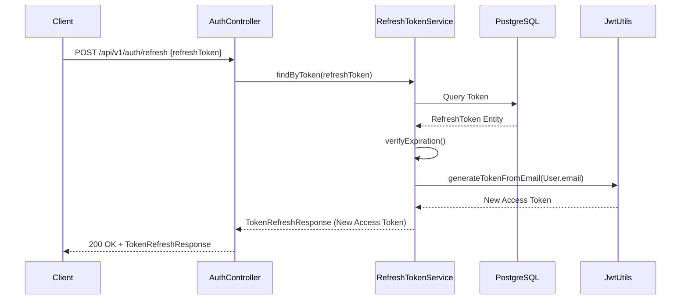

# PulseNotify

PulseNotify is an enterprise-grade, highly scalable distributed notification service designed to handle millions of notifications across various channels, including Email, SMS, and Push.

This project is built to demonstrate advanced system design, event-driven architecture, and robust cloud deployment practices suitable for a production environment.

## Tech Stack

**Backend:**
- Java 21 & Spring Boot 3
- PostgreSQL & Spring Data JPA
- Redis (Caching)
- Spring Security (JWT + RBAC)
- AWS SQS & AWS Lambda

**Frontend:**
- React 18 & TypeScript
- Vite
- React Query & Axios

**DevOps & Cloud:**
- Docker & Docker Compose
- AWS RDS, ElastiCache, ECS

## System Architecture & Workflows

### 1. Modular Monolith Architecture

### 2. AWS Infrastructure

### 3. Notification State Machine

### 4. Authentication Flows
**User Login**

**Refresh Token**

